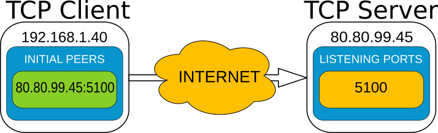
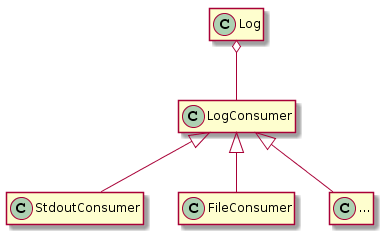

Advanced Functionalities
########################

This section covers slightly more advanced, but useful features that enrich your implementation.

.. _topics-and-keys:

Topics and Keys
***************

The RTPS standard contemplates the use of keys to define multiple data sources/sinks within a single topic.

There are three ways of implementing keys into your topic:

* Defining a `@Key` field in the IDL file when using FastRTPSGen (see the examples that come with the distribution).
* Manually implementing and using a :func:`getKey()` method.
* Adding the attribute `Key` to the member and its parents when using dynamic types (see :ref:`dynamic-types`).

Publishers and Subscribers using topics with keys must be configured to use them, otherwise, they will have no effect:

+--------------------------------------------+
| **C++**                                    |
+--------------------------------------------+
| .. literalinclude:: ../code/CodeTester.cpp |
|    :language: c++                          |
|    :start-after: //CONF-QOS-KEY            |
|    :end-before: //!--                      |
+--------------------------------------------+
| **XML**                                    |
+--------------------------------------------+
| .. literalinclude:: ../code/XMLTester.xml  |
|    :language: xml                          |
|    :start-after: <!-->CONF-QOS-KEY         |
|    :end-before: <!--><-->                  |
+--------------------------------------------+

The RTPS Layer requires you to call the :func:`getKey()` method manually within your callbacks.

You can tweak the History to accommodate data from multiple keys based on your current configuration.
This consist of defining a maximum number of data sinks and a maximum size for each sink:

+--------------------------------------------------------+
| **C++**                                                |
+--------------------------------------------------------+
| .. literalinclude:: ../code/CodeTester.cpp             |
|    :language: c++                                      |
|    :start-after: //CONF-QOS-RESOURCELIMIT-INSTANCES    |
|    :end-before: //!--                                  |
+--------------------------------------------------------+
| **XML**                                                |
+--------------------------------------------------------+
| .. literalinclude:: ../code/XMLTester.xml              |
|    :language: xml                                      |
|    :start-after: <!-->CONF-QOS-RESOURCELIMIT-INSTANCES |
|    :end-before: <!--><-->                              |
+--------------------------------------------------------+

Note that your History must be big enough to accommodate the maximum number of samples for each key.
eProsima Fast RTPS will notify you if your History is too small.

.. _intraprocess-delivery:

Intra-process delivery
**********************

*eProsima Fast RTPS* allows to speed up Intra-process communications by avoiding any copy operation involved with
the transport layer. This feature is disabled by default and must be enable using :ref:`xml-profiles`. Currently the
following options are available:

* **INTRAPROCESS_OFF**. Default value, the feature is disabled.
* **INTRAPROCESS_USER_DATA_ONLY**. Discovery metadata keeps using ordinary transport.
* **INTRAPROCESS_FULL**. Both user data and discovery metadata using Intra-process delivery.

.. _comm-transports-configuration:

Transports
**********

*eProsima Fast RTPS* implements an architecture of pluggable transports.
Current version implements four transports: UDPv4, UDPv6, TCPv4 and TCPv6.
By default, when a :class:`Participant` is created, one built-in UDPv4 transport is configured.
You can add custom transports using the attribute ``rtps.userTransports``.

+-----------------------------------------------------+
| **C++**                                             |
+-----------------------------------------------------+
| .. literalinclude:: ../code/CodeTester.cpp          |
|    :language: c++                                   |
|    :start-after: //CONF-COMMON-TRANSPORT-SETTING    |
|    :end-before: //!--                               |
+-----------------------------------------------------+
| **XML**                                             |
+-----------------------------------------------------+
| .. literalinclude:: ../code/XMLTester.xml           |
|    :language: xml                                   |
|    :start-after: <!-->CONF-COMMON-TRANSPORT-SETTING |
|    :end-before: <!--><-->                           |
+-----------------------------------------------------+

All Transport configuration options can be found in the section :ref:`transportdescriptors`.

.. _comm-transports-tcp:

TCP Transport
=============

Unlike UDP, TCP transport is connection oriented and for that Fast-RTPS must establish a TCP connection
before sending the RTPS messages.
Therefore TCP transport can have two behaviors, acting as a server (**TCP Server**) or as a client (**TCP Client**).
The server opens a TCP port listening for incoming connections and the client tries to connect
to the server.
The server and the client concepts are independent from the RTPS concepts: **Publisher**,
**Subscriber**, **Writer**, and **Reader**.
Any of them can operate as a **TCP Server** or a **TCP Client** because
these entities are used only to establish the TCP connection and the RTPS protocol works over it.

To use TCP transports you need to define some more configurations:

You must create a new TCP transport descriptor, for example TCPv4.
This transport descriptor has a field named ``listening_ports`` that indicates to Fast-RTPS
in which physical TCP ports our participant will listen for input connections.
If omitted, the participant will not be able to receive incoming connections but will be able
to connect to other participants that have configured their listening ports.
The transport must be added to the ``userTransports`` list of the participant attributes.
The field ``wan_addr`` can be used to allow incoming connections using the public IP in a WAN environment or the
Internet.
See `WAN or Internet Communication over TCP/IPv4`_ for more information about how to configure a TCP Transport
to allow or connect to WAN connections.

+--------------------------------------------------+
| **C++**                                          |
+--------------------------------------------------+
| .. literalinclude:: ../code/CodeTester.cpp       |
|    :language: c++                                |
|    :start-after: //CONF-TCP-TRANSPORT-SETTING    |
|    :end-before: //!--                            |
+--------------------------------------------------+
| **XML**                                          |
+--------------------------------------------------+
| .. literalinclude:: ../code/XMLTester.xml        |
|    :language: xml                                |
|    :start-after: <!-->CONF-TCP-TRANSPORT-SETTING |
|    :end-before: <!--><-->                        |
+--------------------------------------------------+

To configure the participant to connect to another node through TCP, you must configure and add a Locator to its
``initialPeersList`` that points to the remote *listening port*.

+---------------------------------------------------+
| **C++**                                           |
+---------------------------------------------------+
| .. literalinclude:: ../code/CodeTester.cpp        |
|    :language: c++                                 |
|    :start-after: //CONF-TCP2-TRANSPORT-SETTING    |
|    :end-before: //!--                             |
+---------------------------------------------------+
| **XML**                                           |
+---------------------------------------------------+
| .. literalinclude:: ../code/XMLTester.xml         |
|    :language: xml                                 |
|    :start-after: <!-->CONF-TCP2-TRANSPORT-SETTING |
|    :end-before: <!--><-->                         |
+---------------------------------------------------+

A TCP version of helloworld example can be found in this
`link <https://github.com/eProsima/Fast-RTPS/tree/master/examples/C%2B%2B/HelloWorldExampleTCP>`_.

WAN or Internet Communication over TCP/IPv4
-------------------------------------------

Fast-RTPS is able to connect through the Internet or other WAN networks when configured properly.
To achieve this kind of scenarios, the involved network devices such as routers and firewalls
should add the rules to allow the communication.

For example, to allow incoming connections through our NAT, Fast-RTPS must be configured as a **TCP Server** listening
to incoming TCP connections.
To allow incoming connections through a WAN, the TCP descriptor associated must indicate
its public IP through its field ``wan_addr``.

+--------------------------------------------------+
| **C++**                                          |
+--------------------------------------------------+
| .. literalinclude:: ../code/CodeTester.cpp       |
|    :language: c++                                |
|    :start-after: //CONF-TCP-TRANSPORT-SETTING    |
|    :end-before: //!--                            |
+--------------------------------------------------+
| **XML**                                          |
+--------------------------------------------------+
| .. literalinclude:: ../code/XMLTester.xml        |
|    :language: xml                                |
|    :start-after: <!-->CONF-TCP-TRANSPORT-SETTING |
|    :end-before: <!--><-->                        |
+--------------------------------------------------+

In this case, configuring the router (which public IP is ``80.80.99.45``) is mandatory to allow the incoming traffic to
reach the **TCP Server**.
Typically a NAT routing with the ``listening_port`` ``5100`` to our machine is enough.
Any existing firewall should be configured as well.

In the client side, it is needed to specify the public IP of the **TCP Server** with its ``listening_port`` as
``initial_peer``.

+---------------------------------------------------+
| **C++**                                           |
+---------------------------------------------------+
| .. literalinclude:: ../code/CodeTester.cpp        |
|    :language: c++                                 |
|    :start-after: //CONF-TCP2-TRANSPORT-SETTING    |
|    :end-before: //!--                             |
+---------------------------------------------------+
| **XML**                                           |
+---------------------------------------------------+
| .. literalinclude:: ../code/XMLTester.xml         |
|    :language: xml                                 |
|    :start-after: <!-->CONF-TCP2-TRANSPORT-SETTING |
|    :end-before: <!--><-->                         |
+---------------------------------------------------+

The combination of the above configurations in both **TCP Server** and **TCP Client** allows a scenario similar to
the represented by the following image.

**IPLocator**

IPLocator is an auxiliary static class that offers methods to ease the management of IP based locators, as UDP or TCP.
In TCP, the port field of the locator is divided into physical and logical port.
The physical port is the port used by the network device, the real port that the operating system understands.
The logical port can be seen as RTPS port, or UDP's equivalent port (physical ports of UDP, are logical ports in TCP).
Logical ports normally are not necessary to manage explicitly, but you can do it through IPLocator class.
Physical ports instead, must be set to explicitly use certain ports, to allow the communication through a NAT, for
example.

.. literalinclude:: ../code/CodeTester.cpp
    :language: c++
    :start-after: //CONF-IPLOCATOR-USAGE
    :end-before: //!--

**NOTE**

TCP doesn't support multicast scenarios, so you must plan carefully your network architecture.

.. _TLS:

TLS over TCP
---------------------------------------------

Fast-RTPS allows configuring a TCP Transport to use TLS (Transport Layer Security)
by setting up **TCP Server** and **TCP Client** properly.

 **TCP Server**

+---------------------------------------------------+
| **C++**                                           |
+---------------------------------------------------+
| .. literalinclude:: ../code/CodeTester.cpp        |
|    :language: c++                                 |
|    :start-after: //CONF-TCP-TLS-SERVER            |
|    :end-before: //!--                             |
+---------------------------------------------------+
| **XML**                                           |
+---------------------------------------------------+
| .. literalinclude:: ../code/XMLTester.xml         |
|    :language: xml                                 |
|    :start-after: <!-->CONF-TCP-TLS-SERVER         |
|    :end-before: <!--><-->                         |
+---------------------------------------------------+

 **TCP Client**

+---------------------------------------------------+
| **C++**                                           |
+---------------------------------------------------+
| .. literalinclude:: ../code/CodeTester.cpp        |
|    :language: c++                                 |
|    :start-after: //CONF-TCP-TLS-CLIENT            |
|    :end-before: //!--                             |
+---------------------------------------------------+
| **XML**                                           |
+---------------------------------------------------+
| .. literalinclude:: ../code/XMLTester.xml         |
|    :language: xml                                 |
|    :start-after: <!-->CONF-TCP-TLS-CLIENT         |
|    :end-before: <!--><-->                         |
+---------------------------------------------------+

More TLS related options can be found in the section :ref:`transportdescriptors`.

Listening locators
==================

*eProsima Fast RTPS* divides listening locators into four categories:

* Metatraffic Multicast Locators: these locators are used to receive metatraffic information using multicast.
  They usually are used by built-in endpoints, like the discovery of built-in endpoints. You can set your own locators
  using attribute ``rtps.builtin.metatrafficMulticastLocatorList``.

  .. literalinclude:: ../code/CodeTester.cpp
      :language: c++
      :start-after: //CONF-METAMULTICASTLOCATOR
      :end-before: //!--

* Metatraffic Unicast Locators: these locators are used to receive metatraffic information using unicast.
  They usually are used by built-in endpoints, like the discovery of built-in endpoints.
  You can set your own locators using attribute ``rtps.builtin.metatrafficUnicastLocatorList``.

  .. literalinclude:: ../code/CodeTester.cpp
      :language: c++
      :start-after: //CONF-METAUNICASTLOCATOR
      :end-before: //!--

* User Multicast Locators: these locators are used to receive user information using multicast. They are used by user
  endpoints. You can set your own locators using attribute ``rtps.defaultMulticastLocatorList``.

  .. literalinclude:: ../code/CodeTester.cpp
      :language: c++
      :start-after: //CONF-USERMULTICASTLOCATOR
      :end-before: //!--

* User Unicast Locators: these locators are used to receive user information using unicast. They are used by user
  endpoints. You can set your own locators using attributes ``rtps.defaultUnicastLocatorList``.

  .. literalinclude:: ../code/CodeTester.cpp
      :language: c++
      :start-after: //CONF-USERUNICASTLOCATOR
      :end-before: //!--

By default *eProsima Fast RTPS* calculates the listening locators for the built-in UDPv4 network transport using
well-known ports. These well-known ports are calculated using the following predefined rules:

.. list-table:: Ports used
   :header-rows: 1

   * - Traffic type
     - Well-known port expression
   * - Metatraffic multicast
     - PB + DG * *domainId* + offsetd0
   * - Metatraffic unicast
     - PB + DG * *domainId* + offsetd1 + PG * *participantId*
   * - User multicast
     - PB + DG * *domainId* + offsetd2
   * - User unicast
     - PB + DG * *domainId* + offsetd3 + PG * *participantId*

These predefined rules use some values explained here:

* DG: DomainId Gain. You can set this value using attribute ``rtps.port.domainIDGain``.
  The default value is ``250``.
* PG: ParticipantId Gain. You can set this value using attribute ``rtps.port.participantIDGain``.
  The default value is ``2``.
* PB: Port Base number. You can set this value using attribute ``rtps.port.portBase``.
  The default value is ``7400``.
* offsetd0, offsetd1, offsetd2, offsetd3: Additional offsets.
  You can set these values using attributes
  ``rtps.port.offsetdN``. Default values are: ``offsetd0 = 0``, ``offsetd1 = 10``, ``offsetd2 = 1``, ``offsetd3 = 11``.

Both UDP and TCP unicast locators support to have a null address.
In that case, *eProsima Fast RTPS* understands to get local network addresses and use them.

Both UDP and TCP locators support to have a zero port.
In that case, *eProsima Fast RTPS* understands to calculate well-known port for that type of traffic.

.. _initial-peers:

Initial peers
=============

These locators are used to know where to send initial discovery network messages. You can set your own locators using
attribute ``rtps.builtin.initialPeersList``. By default *eProsima Fast RTPS* uses as initial peers the Metatraffic
Multicast Locators.

.. literalinclude:: ../code/CodeTester.cpp
    :language: c++
    :start-after: //CONF-INITIALPEERS
    :end-before: //!--

.. _whitelist-interfaces:

Whitelist Interfaces
====================

There could be situations where you want to block some network interfaces to avoid connections or sending data through
them.
This can be managed using the field *interface whitelist* in the transport descriptors, and with them, you can set the
interfaces you want to use to send or receive packets.
The values on this list should match the IPs of your machine in that networks.
For example:

+--------------------------------------------------+
| **C++**                                          |
+--------------------------------------------------+
| .. literalinclude:: ../code/CodeTester.cpp       |
|    :language: c++                                |
|    :start-after: //CONF-TRANSPORT-DESCRIPTORS    |
|    :end-before: //!--                            |
+--------------------------------------------------+
| **XML**                                          |
+--------------------------------------------------+
| .. literalinclude:: ../code/XMLTester.xml        |
|    :language: xml                                |
|    :start-after: <!-->CONF-TRANSPORT-DESCRIPTORS |
|    :lines: 1-8,48                                |
+--------------------------------------------------+

Tips
====

**Disabling all multicast traffic**

+----------------------------------------------+
| **C++**                                      |
+----------------------------------------------+
| .. literalinclude:: ../code/CodeTester.cpp   |
|    :language: c++                            |
|    :start-after: //CONF-DISABLE-MULTICAST    |
|    :end-before: //!--                        |
+----------------------------------------------+
| **XML**                                      |
+----------------------------------------------+
| .. literalinclude:: ../code/XMLTester.xml    |
|    :language: xml                            |
|    :start-after: <!-->CONF-DISABLE-MULTICAST |
|    :end-before: <!--><-->                    |
+----------------------------------------------+

**Non-blocking write on sockets**

For UDP transport, it is possible to configure whether to use non-blocking write calls on the sockets.

+----------------------------------------------+
| **C++**                                      |
+----------------------------------------------+
| .. literalinclude:: ../code/CodeTester.cpp   |
|    :language: c++                            |
|    :start-after: //CONF-NON-BLOCKING-WRITE   |
|    :end-before: //!--                        |
+----------------------------------------------+
| **XML**                                      |
+----------------------------------------------+
| .. literalinclude:: ../code/XMLTester.xml    |
|    :language: xml                            |
|    :start-after: <!-->CONF-NON-BLOCKING-WRITE|
|    :end-before: <!--><-->                    |
+----------------------------------------------+

**XML Configuration**

The :ref:`xml-profiles` section contains the full information about how to setup *Fast RTPS* through an
*XML file*.

.. _flow-controllers:

Flow Controllers
****************

*eProsima Fast RTPS* supports user configurable flow controllers on a Publisher and Participant level. These
controllers can be used to limit the amount of data to be sent under certain conditions depending on the
kind of controller implemented.

The current release implement throughput controllers, which can be used to limit the total message throughput to be sent
over the network per time measurement unit. In order to use them, a descriptor must be passed into the Participant
or Publisher Attributes.

+-----------------------------------------------+
| **C++**                                       |
+-----------------------------------------------+
| .. literalinclude:: ../code/CodeTester.cpp    |
|    :language: c++                             |
|    :start-after: //CONF-QOS-FLOWCONTROLLER    |
|    :end-before: //!--                         |
+-----------------------------------------------+
| **XML**                                       |
+-----------------------------------------------+
| .. literalinclude:: ../code/XMLTester.xml     |
|    :language: xml                             |
|    :start-after: <!-->CONF-QOS-FLOWCONTROLLER |
|    :end-before: <!--><-->                     |
+-----------------------------------------------+

In the Writer-Reader layer, the throughput controller is built-in and the descriptor defaults to infinite throughput.
To change the values:

.. literalinclude:: ../code/CodeTester.cpp
   :language: c++
   :start-after: //CONF_QOS_RTPS_FLOWCONTROLLER
   :end-before: //!

Note that specifying a throughput controller with a size smaller than the socket size can cause messages to never become
sent.

Sending large data
******************

The default message size *eProsima Fast RTPS* uses is a conservative value of 65Kb.
If your topic data is bigger, it must be fragmented.

Fragmented messages are sent over multiple packets, as understood by the particular transport layer.
To make this possible, you must configure the Publisher to work in asynchronous mode.

+--------------------------------------------+
| **C++**                                    |
+--------------------------------------------+
| .. literalinclude:: ../code/CodeTester.cpp |
|    :language: c++                          |
|    :start-after: //CONF-QOS-PUBLISHMODE    |
|    :end-before: //!--                      |
+--------------------------------------------+
| **XML**                                    |
+--------------------------------------------+
| .. literalinclude:: ../code/XMLTester.xml  |
|    :language: xml                          |
|    :start-after: <!-->CONF-QOS-PUBLISHMODE |
|    :end-before: <!--><-->                  |
+--------------------------------------------+

In the Writer-Subscriber layer, you have to configure the Writer:

.. literalinclude:: ../code/CodeTester.cpp
   :language: c++
   :start-after: //CONF_QOS_RTPS_PUBLISHMODE
   :end-before: //!

Note that in best-effort mode messages can be lost if you send big data too fast and the buffer is filled at a faster
rate than what the client can process messages.
On the other hand, in reliable mode, the existence of a lot of data fragments could decrease the frequency at which
messages are received.
If this happens, it can be resolved by increasing socket buffers size, as described in :ref:`tuning-socket-buffer`.
It can also help to set a lower Heartbeat period in reliable mode, as stated in :ref:`tuning-reliable-mode`.

When you are sending large data, it is convenient to setup a flow controller to avoid a burst of messages in the network
and increase performance.
See :ref:`flow-controllers`

Example: Sending a unique large file
====================================

This is a proposed example of how should the user configure its application in order to achieve the best performance.
To make this example more tangible, it is going to be supposed that the file has a size of 9.9MB and the network in
which the publisher and the subscriber are operating has a bandwidth of 100MB/s

First of all, the asynchronous mode has to be activated in the publisher parameters.
Then, a suitable reliability mode has to be selected.
In this case, it is important to make sure that all fragments of the message are received.
The loss of a fragment means the loss of the entire message, so it would be best to choose the reliable mode.

The default message size of this fragments using the UDPv4 transport has a value of 65Kb (which includes the space
reserved for the data and the message header).
This means that the publisher would have to write at least about 1100 fragments.

This amount of fragment could slow down the transmission, so it could be interesting to decrease the heartbeat period
in order to increase the reactivity of the publisher.

Another important consideration is the addition of a flow controller.
Without a flow controller, the publisher can occupy the entire bandwidth.
A reasonable flow controller for this application could be a limit of 5MB/s, which represents only 5% of the total
bandwidth.
Anyway, these values are highly dependent on the specific application and its desired behavior.

At last, there is another detail to have in mind: it is critical to check the size of the system UDP buffers.
In Linux, buffers can be enlarged with

.. code-block:: bash

    sysctl -w net.ipv4.udp_mem="102400 873800 16777216"
    sysctl -w net.core.netdev_max_backlog="30000"
    sysctl -w net.core.rmem_max="16777216"
    sysctl -w net.core.wmem_max="16777216"

Example: Video streaming
========================

In this example, the target application transmits video between a publisher and a subscriber.
This video will have a resolution of 640x480 and a frequency of 50fps.

As in the previous example, since the application is sending data that requires fragmentation, the asynchronous mode
has to be activated in the publisher parameters.

In audio or video transmissions, sometimes is better to have a stable and high datarate feed than a 100% lossless
communication.
Working with a frequency of 50Hz makes insignificant the loss of one or two samples each second.
Thus, for a higher performance, it can be appropriate to configure the reliability mode to best-effort.

.. _discovery:

Discovery
*********

Fast RTPS provides a discovery mechanism that allows matching automatically publishers and subscribers.
The discovery mechanism is divided into two phases: Participant Discovery Phase and Endpoints Discovery Phase.

* Participant Discovery Phase (PDP)
    Before discovering any entity of a remote participant, both participants have to meet between them.
    Participant Discovery Phase provides this step and is responsible for sending periodic information about itself.
    To know how to configure where to send this periodic information, see :ref:`initial-peers`.
    To know how to configure the announcement period and count, see :ref:`Discovery Configuration <dconf>`.
    When both participants are met, is the turn of Endpoints Discovery Phase.

* Endpoints Discovery Phase (EDP)
    This phase is responsible for sending entities information to the remote participant.
    Also, it has to process the entities information of the remote participant and check which entities can match
    between them.

.. _discovery_protocol_enum:

There are several possible choices for the PDP strategy comprised into the :code:`enum DiscoveryProtocol_t`:

- **NONE** which disables the PDP discovery. This setting is only compatible with the RTPSDomain layer. User must
  manually match and unmatch RTPS endpoints using whatever external meta-information channel of its choice.

- **SIMPLE** generates a standard participant with complete backward compatibility with any other RTPS implementation.

- **CLIENT** generates a *client* participant, which relies on a server to be notified of other *clients* presence.
  This participant can create publishers and subscribers of any topic (static or dynamic) as ordinary participants do.

- **SERVER** generates a *server* participant, which receives, manages and spreads its linked *clients* metatraffic
  assuring any single one is aware of the others. This participant can create publishers and subscribers of any topic
  (static or dynamic) as ordinary participants do. Servers can link to other servers in order to share its clients
  information.

- **BACKUP** generates a *server* participant with additional functionality over **SERVER**. Specifically, it uses a
  database to backup its client information, so that if for whatever reason it disappears, it can be automatically
  restored and continue spreading metatraffic to late joiners. A **SERVER** in the same scenario ought to collect
  client information again, introducing a recovery delay.

For an extensive explanation of **CLIENT**, **SERVER** and **BACKUP** discovery strategies please refer to
`Discovery Server documentation <https://eprosima-discovery-server.readthedocs.io/en/latest/>`_. The non-**SIMPLE** PDP
strategies were devised to cope with several scenarios where the standard PDP was unsuitable or plainly cannot be
applied:

+ a high number of endpoint entities which are continuously entering and exiting a large network.

+ a network without multicasting capabilities.

Lack of multicast discovery mechanism is covered by providing one or several servers whose addresses are known
beforehand by any other participant (clients). These servers centralize the distribution of meta-information
(participant discovery information); thus, there is no longer need of participants exchanging discovery messages
among them.

The basic mechanisms mimic to some extent the standard ones:

+ as in the standard, clients send periodically announcements of its own discovery data. But the recipients of these
  messages are only its servers, and only until servers don't acknowledge clients announcements. Once a server
  acknowledges a client announcement, there is a reliable PDP connection established, and the client becomes a mere
  recipient of server's discovery data.

+ as in the standard, clients make periodical participant liveliness announcements (*lease duration*). But these
  messages are only exchanged between a client and its servers. Thus:

 - other participants (clients or servers) demise by *lease duration* would be reported by the linked servers.

 - server demises by *lease duration* would automatically trigger the client's announcement until the server
   communication
   is restored and acknowledges again client's announcements.

Discovery related attributes
============================

Discovery is managed from the RTPSDomain layer, thus all related attributes are constrained to this layer:

RTPSParticipantAttributes
-------------------------

+ a `GuidPrefix_t guidPrefix` member specifies server's identity.  This member has only significance if
  `discovery_config.discoveryProtocol` is **SERVER** or **BACKUP**. There is a `ReadguidPrefix` method to easily fill in
  this member from a string formatted like `"4D.49.47.55.45.4c.5f.42.41.52.52.4f"` (note that each byte must be a valid
  hexadecimal figure).

BuiltinAttributes
-----------------

+ All discovery related info is gathered in a `DiscoverySettings discovery_config` member.

+ In order to receive client metatraffic, `metatrafficUnicastLocatorList` or `metatrafficMulticastLocatorList` must be
  populated with the addresses that were given to the clients.

DiscoverySettings
-----------------

+ a **DiscoveryProtocol_t discoveryProtocol** member specifies the participant's discovery kind. Already described `in
  discovery introduction <discovery_protocol_enum_>`_.

 By default, the discovery mechanism is enabled, but you can disable it through participant attributes.

 +--------------------------------------------------+
 | **C++**                                          |
 +--------------------------------------------------+
 | .. literalinclude:: ../code/CodeTester.cpp       |
 |    :language: c++                                |
 |    :start-after: //CONF-QOS-DISABLE-DISCOVERY    |
 |    :end-before: //!--                            |
 +--------------------------------------------------+
 | **XML**                                          |
 +--------------------------------------------------+
 | .. literalinclude:: ../code/XMLTester.xml        |
 |    :language: xml                                |
 |    :start-after: <!-->CONF-QOS-DISABLE-DISCOVERY |
 |    :end-before: <!--><-->                        |
 +--------------------------------------------------+

+ a **ignoreParticipantFlags** member specifies participant filtering criteria to optimize discovery stage speed
  and memory usage. This feature is only available for the `SIMPLE` discovery protocol with disable security (all secure
  participants are considered created by a different host). There are several options:

 * **FILTER_DIFFERENT_HOST** all metadata from another host would be discarded.
 * **FILTER_DIFFERENT_PROCESS** all metadata from another process on the same host would be discarded.
 * **FILTER_SAME_PROCESS** all metadata from our own process would be discarded.
 * **FILTER_DIFFERENT_PROCESS | FILTER_SAME_PROCESS** all metadata from our own host would be discarded.

+ **use_XXX_EndpointDiscoveryProtocol** flags. There is a specific section dealing with them
  (see `Static Endpoints Discovery`_).

+ **SimpleEDPAttributes m_simpleEDP**. Gathers all attributes related to EDPSimple behavior. A participant may create
  publishers, subscribers, both or neither. This class allows us to save the number of builtin endpoints to those
  strictly necessary. For PDP **SERVER** the only possible choice is the default value that creates all builtin
  endpoints because it must relay all clients EDP info.

  +---------------------------------------------------------+
  | **C++**                                                 |
  +---------------------------------------------------------+
  | .. literalinclude:: ../code/CodeTester.cpp              |
  |    :language: c++                                       |
  |    :start-after: //CONF-QOS-DISCOVERY-EDP-ATTRIBUTES    |
  |    :end-before: //!--                                   |
  +---------------------------------------------------------+
  | **XML**                                                 |
  +---------------------------------------------------------+
  | .. literalinclude:: ../code/XMLTester.xml               |
  |    :language: xml                                       |
  |    :start-after: <!-->CONF-QOS-DISCOVERY-EDP-ATTRIBUTES |
  |    :end-before: <!--><-->                               |
  +---------------------------------------------------------+

+ a **RemoteServerList_t  m_DiscoveryServers** lists the servers linked to the participant. This member has only
  significance if **discoveryProtocol** is **CLIENT**, **SERVER** or **BACKUP**. These member elements are
  *RemoteServerAttributes* objects that identify each server and report where the servers can be reached:

 - **GuidPrefix_t guidPrefix** is the RTPS unique identifier of the server participant we want to link to. There is a
   `ReadguidPrefix` method to easily fill in this member from a string formatted like
   *"4D.49.47.55.45.4c.5f.42.41.52.52.4f"* (note that each octet must be a valid hexadecimal figure).
 - **metatrafficUnicastLocatorList** and `metatrafficMulticastLocatorList` are ordinary `LocatorList_t` (see fast-RTPS
   documentation) where server's locators must be specified. At least one of them should be populated.
 - **Duration_t discoveryServer_client_syncperiod** specifies the time span between PDP metatraffic exchange, and has
   only significance if `discoveryProtocol` is **CLIENT**, **SERVER** or **BACKUP**. The default value is half a second.

  +-----------------------------------------------------+
  | **C++**                                             |
  +-----------------------------------------------------+
  | .. literalinclude:: ../code/CodeTester.cpp          |
  |    :language: c++                                   |
  |    :start-after: //CONF-QOS-DISCOVERY-SERVERLIST    |
  |    :end-before: //!--                               |
  +-----------------------------------------------------+
  | **XML**                                             |
  +-----------------------------------------------------+
  | .. literalinclude:: ../code/XMLTester.xml           |
  |    :language: xml                                   |
  |    :start-after: <!-->CONF-QOS-DISCOVERY-SERVERLIST |
  |    :end-before: <!--><-->                           |
  +-----------------------------------------------------+

+ **Duration_t leaseDuration**. Linked with the participant *liveliness mechanism* it specifies how much time other
  remote participants should consider this one alive.

+ **Duration_t leaseDuration_announcementperiod**. Linked either with participant *liveliness and announcement
  mechanisms*. It specifies how often a participant should send its discovery data in order to notify new participants
  and refresh old ones *liveliness*:

 - For liveliness sake it should be smaller than the *leaseDuration* in order to avoid other participants to kill this
   one.

 - There is a trade-off involved with the announcement. Too frequent announcement will bloat the network with
   metatraffic but too scarce ones will delay the discovery of late joiners.

  +--------------------------------------------------------+
  | **C++**                                                |
  +--------------------------------------------------------+
  | .. literalinclude:: ../code/CodeTester.cpp             |
  |    :language: c++                                      |
  |    :start-after: //CONF-QOS-DISCOVERY-LEASEDURATION    |
  |    :end-before: //!--                                  |
  +--------------------------------------------------------+
  | **XML**                                                |
  +--------------------------------------------------------+
  | .. literalinclude:: ../code/XMLTester.xml              |
  |    :language: xml                                      |
  |    :start-after: <!-->CONF-QOS-DISCOVERY-LEASEDURATION |
  |    :end-before: <!--><-->                              |
  +--------------------------------------------------------+

+ **Duration_t discoveryServer_client_syncperiod**. Linked either with client's *announcement mechanism*. It specifies
  how often a client should send its discovery data to a server that is not yet aware of its presence. Given the fact
  that this announcement will be shut down the very moment the server acknowledges the client, its frequency will not
  be a concern for network traffic outside network initialization stage.

 Note that servers act like clients whenever they reference other servers, thus, *discoveryServer_client_syncperiod*
 applies to them also in this scenario.

Static Endpoints Discovery
==========================

Endpoints Discovery Phase can be replaced by a static version that doesn't send any information.
It is useful when you have a limited network bandwidth and a well-known schema of publishers and subscribers.
Instead of receiving entities information for matching, this information is loaded from an XML file.

First of all, you have to disable the Endpoints Discovery Phase and enable the Static Endpoints Discovery.
This can be done from the participant attributes.

.. literalinclude:: ../code/CodeTester.cpp
   :language: c++
   :start-after: //CONF_QOS_STATIC_DISCOVERY_CODE
   :end-before: //!

Then, you will need to load the XML file containing the configuration of the remote participant.
So, for example, if there is a remote participant with a subscriber which is waiting to receive samples from your
publisher, you will need to load the configuration of this remote participant.

.. literalinclude:: ../code/CodeTester.cpp
   :language: c++
   :start-after: //CONF_QOS_STATIC_DISCOVERY_XML
   :end-before: //!

A basic XML configuration file for this remote participant would contain information like the name of the remote
participant, the topic name and data type of the subscriber, and its entity and user-defined ID.
All these values have to exactly match the parameter values used to configure the remote participant (through the
class :class:`ParticipantAttributes`) and its subscriber (through the class :class:`SubscriberAttributes`).
Missing elements will acquire default values. For example:

.. literalinclude:: ../code/StaticTester.xml
   :language: xml
   :start-after: <!-->STATIC_DISCOVERY_CONF<-->
   :end-before: <!--><-->
   :lines: 1-10,20

The XML that configures the participant on the other side (in this case, a subscriber) could look like this:

.. literalinclude:: ../code/StaticTester.xml
   :language: xml
   :start-after: <!-->STATIC_DISCOVERY_CONF<-->
   :end-before: <!--><-->
   :lines: 1,11-20

You can find an example that uses
`Static Endpoint Discovery <https://github.com/eProsima/Fast-RTPS/blob/master/examples/C%2B%2B/StaticHelloWorldExample>`_.

The complete list of fields for readers and writers includes the following parameters:

* **userId**: numeric value.
* **entityID**: numeric value.
* **expectsInlineQos**: *true* or *false*. **(only valid for readers)**
* **topicName**: text value.
* **topicDataType**: text value.
* **topicKind**: *NO_KEY* or *WITH_KEY*.
* **reliabilityQos**: *BEST_EFFORT_RELIABILITY_QOS* or *RELIABLE_RELIABILITY_QOS*.
* **unicastLocator**
    - `address`: text value.
    - `port`: numeric value.
* **multicastLocator**
    - `address`: text value.
    - `port`: numeric value.
* **topic**
    - `name`: text value.
    - `data type`: text value.
    - `kind`: text value.
* **durabilityQos**: *VOLATILE_DURABILITY_QOS*, *TRANSIENT_LOCAL_DURABILITY_QOS* or *TRANSIENT_DURABILITY_QOS*.
* **ownershipQos**
    - `kind`: *SHARED_OWNERSHIP_QOS* or *EXCLUSIVE_OWNERSHIP_QOS*.
* **partitionQos**: text value.
* **livelinessQos**
    - `kind`: *AUTOMATIC_LIVELINESS_QOS*, *MANUAL_BY_PARTICIPANT_LIVELINESS_QOS* or *MANUAL_BY_TOPIC_LIVELINESS_QOS*.
    - `leaseDuration_ms`: numeric value.

Subscribing to Discovery Topics
*******************************

As specified in the :ref:`discovery` section, the Participant or RTPS Participant has a series of meta-data endpoints
for use during the discovery process.
The participant listener interface includes methods which are called each time a Publisher or a Subscriber is
discovered.
This allows you to create your own network analysis tools.

+--------------------------------------------------+
| **Implementation of custom listener**            |
+--------------------------------------------------+
| .. literalinclude:: ../code/CodeTester.cpp       |
|    :language: c++                                |
|    :start-after: //API-DISCOVERY-TOPICS-LISTENER |
|    :end-before: //!--                            |
+--------------------------------------------------+
| **Setting the custom listener**                  |
+--------------------------------------------------+
| .. literalinclude:: ../code/CodeTester.cpp       |
|    :language: c++                                |
|    :start-after: //API-DISCOVERY-TOPICS-SET      |
|    :end-before: //!--                            |
+--------------------------------------------------+

The callbacks defined in the ReaderListener you attach to the EDP will execute for each data message after
the built-in protocols have processed it.

Tuning
******

Taking advantage of multicast
=============================

For topics with several subscribers, it is recommendable to configure them to use multicast instead of unicast.
By doing so, only one network package will be sent for each sample.
This will improve both CPU and network usage. Multicast configuration is explained in :ref:`multicast-locators`.

.. _tuning-socket-buffer:

Increasing socket buffers size
==============================

In high rate scenarios or large data scenarios, the bottleneck could be the size of the socket buffers.
Network packages could be dropped because there is no space in the socket buffer.
Using Reliable :ref:`reliability` *Fast RTPS* will try to recover lost samples, but with the penalty of retransmission.
Using Best-Effort :ref:`reliability` samples will be definitely lost.

By default *eProsima Fast RTPS* creates socket buffers with the system default size, but you can modify it.
``sendSocketBufferSize`` attribute helps to increase the socket buffer used to send data.
``listenSocketBufferSize`` attribute helps to increase the socket buffer used to read data.

   +-------------------------------------------------------+
   | **C++**                                               |
   +-------------------------------------------------------+
   | .. literalinclude:: ../code/CodeTester.cpp            |
   |    :language: c++                                     |
   |    :start-after: //CONF-QOS-INCREASE-SOCKETBUFFERS    |
   |    :lines: 1-2                                        |
   +-------------------------------------------------------+
   | **XML**                                               |
   +-------------------------------------------------------+
   | .. literalinclude:: ../code/XMLTester.xml             |
   |    :language: xml                                     |
   |    :start-after: <!-->CONF-QOS-INCREASE-SOCKETBUFFERS |
   |    :lines: 1-6                                        |
   +-------------------------------------------------------+

Finding out system maximum values
---------------------------------

Linux operating system sets a maximum value for socket buffer sizes.
When you set in *Fast RTPS* a socket buffer size, your value cannot exceed the maximum value of the system.

To get these values you can use the command ``sysctl``.
Maximum buffer size value of socket buffers used to send data could be retrieved using this command:

.. code-block:: bash

   $> sudo sysctl -a | grep net.core.wmem_max
   net.core.wmem_max = 1048576

For socket buffers used to receive data the command is:

.. code-block:: bash

   $> sudo sysctl -a | grep net.core.rmem_max
   net.core.rmem_max = 4194304

If these default maximum values are not enough for you, you can also increase them.

.. code-block:: bash

    $> echo 'net.core.wmem_max=12582912' >> /etc/sysctl.conf
    $> echo 'net.core.rmem_max=12582912' >> /etc/sysctl.conf

.. _tuning-reliable-mode:

Tuning Reliable mode
====================

RTPS protocol can maintain reliable communication using special messages (Heartbeat and Ack/Nack messages).
RTPS protocol can detect which samples are lost and re-sent them again.

You can modify the frequency these special submessages are exchanged by specifying a custom heartbeat period.
The heartbeat period in the Publisher-Subscriber level is configured as part of the :class:`ParticipantAttributes`:

.. literalinclude:: ../code/CodeTester.cpp
   :language: c++
   :start-after: //CONF_QOS_TUNING_RELIABLE_PUBLISHER
   :end-before: //!--

In the Writer-Reader layer, this belongs to the :class:`WriterAttributes`:

.. literalinclude:: ../code/CodeTester.cpp
   :language: c++
   :start-after: //CONF_QOS_TUNING_RELIABLE_WRITER
   :end-before: //!--

A smaller heartbeat period increases the number of overhead messages in the network,
but speeds up the system response when a piece of data is lost.

Non-strict reliability
----------------------

Using a strict reliability, configuring :ref:`history-qos` kind as ``KEEP_ALL``, determines all samples have to be
received by all subscribers.
This implicates a performance decrease in case a lot of samples are dropped.
If you don't need this strictness, use a non-strict reliability, i.e. configure :ref:`history-qos` kind as
``KEEP_LAST``.

Slow down sample rate
=====================

Sometimes publishers could send data in a too high rate for subscribers.
This can end dropping samples.
To avoid this you can slow down the rate using :ref:`flow-controllers`.

Additional Quality of Service options
*************************************

As a user, you can implement your own quality of service (QoS) restrictions in your application. *eProsima Fast RTPS*
comes bundled with a set of examples of how to implement common client-wise QoS settings:

* Ownership Strength: When multiple data sources come online, filter duplicates by focusing on the higher priority
  sources.
* Filtering: Filter incoming messages based on content, time, or both.

These examples come with their own `Readme.txt` that explains how the implementations work.

Logging
*******

Fast RTPS includes an extensible logging system with the following class hierarchy:

:class:`Log` is the entry point of the Logging system.
It exposes three macro definitions to ease its usage:

.. literalinclude:: ../code/CodeTester.cpp
    :language: c++
    :start-after: //LOG_USAGE_PRINT
    :end-before: //!--

In all cases, :class:`INFO_MSG`, :class:`WARN_MSG` and :class:`ERROR_MSG` will be used as category for the log entry as
a preprocessor string, so you can use define any category inline.

.. literalinclude:: ../code/CodeTester.cpp
    :language: c++
    :start-after: //LOG_USAGE_INFO
    :end-before: //!--

You can control the verbosity of the log system and filter it by category:

.. literalinclude:: ../code/CodeTester.cpp
    :language: c++
    :start-after: //LOG_USAGE_VERBOSITY
    :end-before: //!--

The possible verbosity levels are :class:`Log::Kind::Info`, :class:`Log::Kind::Warning` and :class:`Log::Kind::Error`.

When selecting one of them, you also select the ones with more priority.

* Selecting :class:`Log::Kind::Error`, you will only receive error messages.
* Selecting :class:`Log::Kind::Warning` you select :class:`Log::Kind::Error` too.
* Selecting :class:`Log::Kind::Info` will select all of them

To filter by category, you must provide a valid :class:`std::regex` expression that will be applied to the category.
The categories that matches the expression, will be logged.

By default, the verbosity is set to :class:`Log::Kind::Error` and without category filtering.

There are some others configurable parameters:

.. literalinclude:: ../code/CodeTester.cpp
    :language: c++
    :start-after: //LOG_USAGE_API
    :end-before: //!--

LogConsumers
============

LogConsumers are classes that implement how to manage the log information.
They must be registered into the Log system to be called with the log messages (after filtering).

Currently there are two LogConsumer implementations:

- :class:`StdoutConsumer`:
    Default consumer, it prints the logging messages to the standard output.
    It has no configuration available.

- :class:`FileConsumer`:
    It prints the logging messages to a file. It has two configuration parameters:

      * :class:`filename` that defines the file where the consumer will write the log messages.
      * :class:`append` that indicates to the consumer if the output file must be opened to append new content.

    By default, :class:`filename` is **output.log** and :class:`append` is equals to **false**.

If you want to add a consumer to manage the logs, you must call the :class:`RegisterConsumer` method of the Log.
To remove all consumers, including the default one, you should call the :class:`ClearConsumers` method.
If you want to reset the Log configuration to its defaults, including recovering the default consumer, you can call to
its :class:`Reset` method.

.. literalinclude:: ../code/CodeTester.cpp
    :language: c++
    :start-after: //LOG-CONFIG
    :end-before: //!--

XML Log configuration
=====================

You can configure the logging system through xml with the tag :class:`<log>` under the :class:`<dds>` tag, or as an
standalone file (without the :class:`<dds>` tag, just :class:`<log>` as root).
You can set :class:`<use_default>` and a set of :class:`<consumer>`.
Each :class:`<consumer>` is defined by its :class:`<class>` and a set of :class:`<property>`.

.. literalinclude:: ../code/XMLTester.xml
    :language: xml
    :start-after: <!-->LOG-CONFIG<-->
    :end-before: <!--><-->

:class:`<use_default>` indicates if we want to use the default consumer :class:`StdoutConsumer`.

Each :class:`<consumer>` defines a consumer that will be added to the consumers list of the Log.
:class:`<class>` indicates which consumer class to instantiate and the set of :class:`<property>` configures it.
:class:`StdoutConsumer` has no properties to be configured, but :class:`FileConsumer` has :class:`filename`
and :class:`append`.

This marks the end of this document.
We recommend you to take a look at the Doxygen API reference and the embedded examples that come with the distribution.
If you need more help, send us an email to `support@eprosima.com`.
