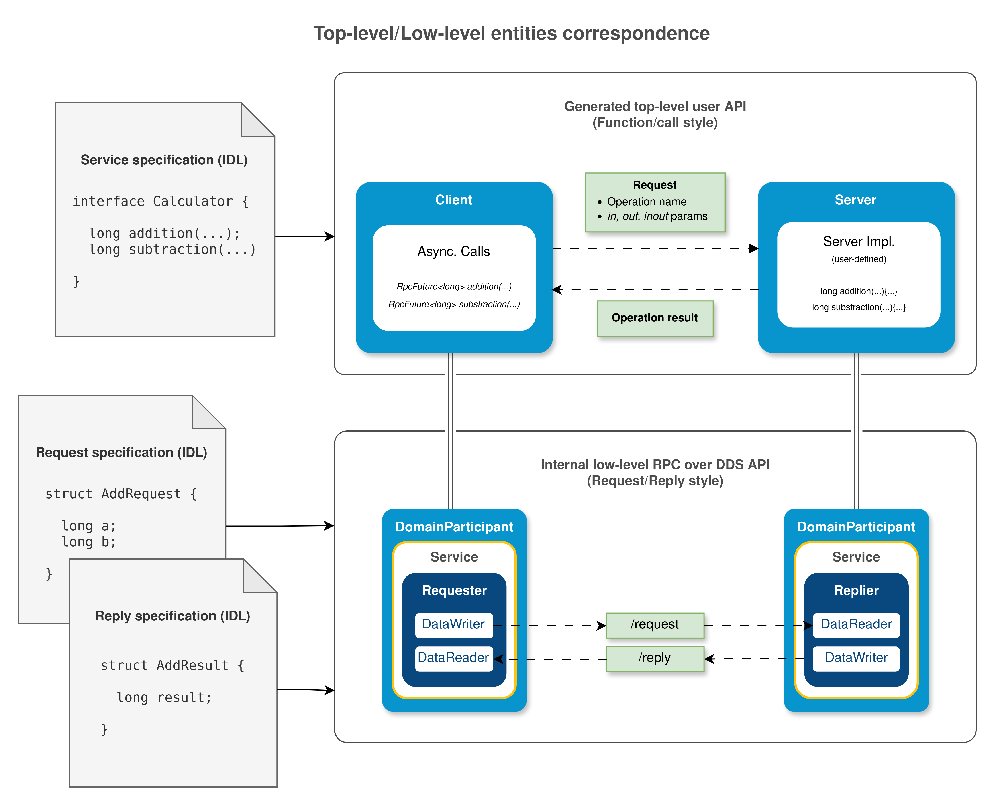

.. include:: ../../03-exports/aliases.include
.. include:: ../../03-exports/aliases-api.include
.. include:: ../../03-exports/roles.include

.. _rpc_dds_intro:

RPC over DDS
============

.. _RPC over DDS specification: https://www.omg.org/spec/DDS-RPC/1.0/PDF

*Remote Procedure Calls* (see `RPC over DDS specification`_), also known as RPC,
is a type of bidirectional communication, used in a request-reply pattern, that can be implemented
using DDS entities such as DomainParticipants, Topics, DataWriters and DataReaders.

The RPC architecture is based on the client-server model: the client sends a request to the server,
and the server sends one response (reply) back to the client.

The RPC specification provides two different APIs to build RPC over DDS applications:

* *A low-level request/reply API* (see :ref:`request_reply_api_intro`), which is based on the DDS API.
  Clients and Servers are modeled by a *Requester* or *Replier* entities, respectively,
  and created from a DomainParticipant.

  Each *Requester* and *Replier* contains a DataWriter and DataReader to send and receive samples.
  Requester sends request samples to the the Replier through a request topic,
  and the Replier, after processing the data and computing the result of the operation,
  sends reply samples back to the Requester through a different topic (reply topic).

  This API is intended to be used internally by the *Fast DDS-Gen* tool, so it is not recommended
  to be used directly by the user.

* *A high-level function-call style based API*, built on top of the request/reply API, and generated automatically
  from an IDL file, containing an interface with the operations to be used by both client and server.

  This high level API is intended to be used to implement RPC applications with multiple data flows.

  Once the user declares the methods in the IDL file, a code generator generates the source code required
  to make remote invokations in a function-call, user-friendly style, and provides a source file to allow the user to
  implement the operations in the server side:

.. note::
    The current version of *Fast DDS-Gen* does not generate code for interfaces.

|br|

.. toctree::
   :maxdepth: 2

   /fastdds/rpc_dds/request_reply/request_reply_api_intro
   /fastdds/rpc_dds/exceptions/rpc_exceptions
